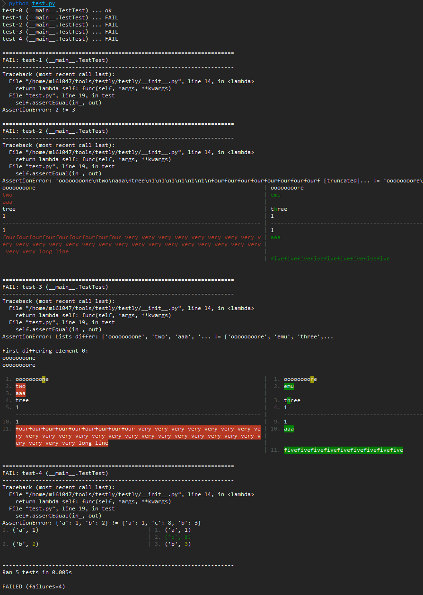
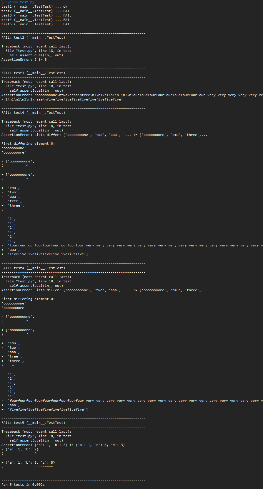

# testly - Enhanced unittest with data provider and more for python

![Pypi][1] ![Github][2] ![Codacy][3] ![Codacy coverage][4] ![Travis building][5]

## Features
- Data provider
- Compatible with `unittest`
- Python2, 3 compatible
- Command line argument to run a test set (by the same data provider)

## Install
```shell
# install released version
pip install python-testly
# install latest version
pip install git+git://github.com/pwwang/testly.git
```

## Get started
### Write your test suite:
```python
import testly
class Test(testly.TestCase):

    # your tests go here
    pass

if __name__ == '__main__':
    testly.main(verbosity = 2)
```

### Python2,3 compatible asserts
```python
class Test(testly.TestCase):

    def test(self):
        self.assertCountEqual([1,2], [2,1])
        self.assertRaisesRegex(ZeroDivisionError, "(integer )?division (or modulo )?by zero", lambda: 1/0)
        self.assertRegex('abcd', r'\w+')
```

### Useful extended asserts
```python
class Test(testly.TestCase):

    def test(self):
        self.assertDictContains({'a': 1}, {'a': 1, 'b': 2})
        self.assertDictNotContains({'a': 2}, {'a': 1, 'b': 2})
        self.assertSeqContains([1], [1, 2])
        self.assertSeqNotContains([3], [1, 2])
        self.assertInAny('dogs', ['one dog', 'two dogs'])
        self.assertNotInAny('cat', ['one dog', 'two dogs'])
        self.assertRegexAny(r'dogs?', ['one dog', 'two dogs'])
        self.assertNotRegexAny(r'cat', ['one dog', 'two dogs'])
```

### Use data provider
```python
class TestTest(testly.TestCase):

    def dataProvider_test(self):
        # use tuple
        yield 1, 1
        # use dict
        yield dict(in_ = 2, out = 2)
        # use testly data composer
        yield testly.Data(4, out = 4)

    def test(self, in_, out):
        self.assertEqual(in_, out)
```

```shell
> python test.py
test-0 (__main__.TestTest) ... ok
test-1 (__main__.TestTest) ... ok
test-2 (__main__.TestTest) ... ok
test-3 (__main__.TestTest) ... ok
```

### Colored diff output
```python
class TestTest(testly.TestCase):

    def dataProvider_test(self):
        yield 1, 1
        yield 2, 3
        yield '\n'.join(['oooooooone', 'two', 'aaa', 'tree', '1', '1', '1', '1', '1', '1', 'fourfourfourfourfourfourfourfourfour very very very very very very very very very very very very very very very very very very very very very very very very very very long line']), '\n'.join(['oooooooore', 'emu', 'three', '1', '1', '1', '1', '1', '1', 'aaa', 'fivefivefivefivefivefivefivefivefive'])
        yield ['oooooooone', 'two', 'aaa', 'tree', '1', '1', '1', '1', '1', '1', 'fourfourfourfourfourfourfourfourfour very very very very very very very very very very very very very very very very very very very very very very very very very very long line'], ['oooooooore', 'emu', 'three', '1', '1', '1', '1', '1', '1', 'aaa', 'fivefivefivefivefivefivefivefivefive']
        yield {'a':1, 'b':2}, {'a':1, 'b':3, 'c': 8}

    def test(self, in_, out):
        self.diffColWidth = 160 # max columns of the diff region
        self.diffContext  = 1   # number context lines to show
        if not isinstance(in_, (dict, list)):
            self.diffLineNo = False # line number
        if isinstance(in_, list):
            self.diffTheme = 'contrast' # the theme
        self.assertEqual(in_, out)
```


Compared to the original `unittest` output:  


### Run a specific test or test set
```python
import sys, testly

class TestTest(testly.TestCase):

    def setUp(self):
        # setUp for test set
        if self.isFirst():
            sys.stderr.write('TestSet %s starts ... ' % self.setName())
        # setUp for regular tests
        elif not self.isOfSet():
            # regulator setUp for other tests
            sys.stderr.write('Test %s starts ...' % self._testMethodName)

    def tearDown(self):
        # tearDown for test set
        if self.isLast():
            sys.stderr.write('TestSet %s ends ... ' % self.setName())
        # tearDown for regular tests
        elif not self.isOfSet():
            # regulator setUp for other tests
            sys.stderr.write('Test %s ends ... ' % self._testMethodName)

    def dataProvider_test1(self):
        yield 1, 1
        yield 2, 2
        yield 3, 3

    def test1(self, in_, out):
        self.assertEqual(in_, out)

    # regular test
    def test2(self):
        self.assertEqual(1, 1)

if __name__ == '__main__':
    testly.main(verbosity = 2)
```

#### Run all tests:
```shell
> python test.py
test1-0 (__main__.TestTest) ... TestSet test1 starts ... ok
test1-1 (__main__.TestTest) ... ok
test1-2 (__main__.TestTest) ... TestSet test1 ends ... ok
test2 (__main__.TestTest) ... Test test2 starts ...Test test2 ends ... ok

----------------------------------------------------------------------
Ran 4 tests in 0.000s

OK
```

#### Run a specific test (`setUp`, `tearDown` for test set also work):
```shell
> python test.py TestTest.test1-2
test1-2 (__main__.TestTest) ... TestSet test1 starts ... TestSet test1 ends ... ok

----------------------------------------------------------------------
Ran 1 test in 0.000s

OK
```
```shell
> python test.py TestTest.test2
test2 (__main__.TestTest) ... Test test2 starts ...Test test2 ends ... ok

----------------------------------------------------------------------
Ran 1 test in 0.000s

OK
```

#### Run a specific test set:
```shell
> python test.py TestTest.test1
test1-0 (__main__.TestTest) ... TestSet test1 starts ... ok
test1-1 (__main__.TestTest) ... ok
test1-2 (__main__.TestTest) ... TestSet test1 ends ... ok

----------------------------------------------------------------------
Ran 3 tests in 0.000s

OK
```

[1]: https://img.shields.io/pypi/v/python-testly.svg?style=flat-square
[2]: https://img.shields.io/github/tag/pwwang/testly.svg?style=flat-square
[3]: https://img.shields.io/codacy/grade/47cf43d246ac4696a106ef4b4fd0c9ec.svg?style=flat-square
[4]: https://img.shields.io/codacy/coverage/47cf43d246ac4696a106ef4b4fd0c9ec.svg?style=flat-square
[5]: https://img.shields.io/travis/pwwang/testly.svg?style=flat-square